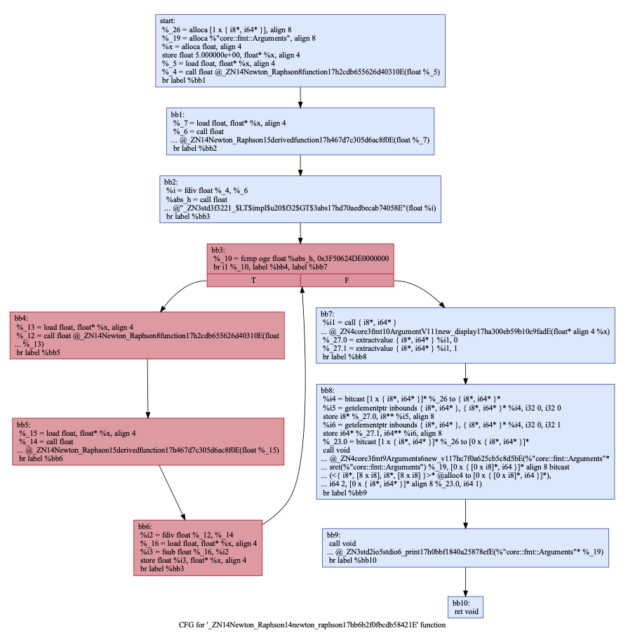

# Newton-Raphson: C++ to IR

In this tutorial, we will focus on the Newton-Raphson algorithm written in C++ and create IR for the algorithm.

The sample code for the Newton-Raphson algorithm, written in C++, is given below:

```c
#include<stdlib.h>
#include<iostream>
#include<vector>
#include<string>
#include<algorithm>
#define EPSILON 0.001

// Newton-Raphson Method for extended example of creation IR:
// The function is : (4/3)x^3 - (3/2)x^2 + 8
double function(double x)
{
    return (4/3)*x*x*x - (3/2)*x*x + 8;
}

// Derivative of the function
double derivedFunction(double x)
{
    return 4*x*x - 3*x;
}

// Root finding via Newton-Raphson
void newtonRaphson(double x)
{
    double h = function(x) / derivedFunction(x);
    while (abs(h) >= EPSILON)
    {
        h = function(x)/derivedFunction(x);
        // Iteration
        // x(i+1) = x(i) - f(x) / f'(x)
        x = x - h;
    }
    std::cout << "The value of the root is : " << x;
}

int main()
{
    double x0 = 5; // Initial value
    newtonRaphson(x0);
    return 0;
}
```

As a next step, we will create front-emd LLVM IR with `clang` and put it into the directory becaue it is too long to represent here.

## IR Result

As mentioned, we put the human-readable .ll file output to the directory as a `newton_raphson.ll`.

The results show that the LLVM IR code version takes too much time to read and is a little complicated. We will use `opt` to optimize the old LLVM IR to the new LLVM IR.

## Middle End "opt"

In compiler infrastructure, `opt` is the middle-end, and what `opt` does is use the old LLVM-IR to create a new LLVM-IR. `opt` is a command-line tool used for visualization, analysis, and optimization. `opt` represents the program `.dot` format. We will use this code to optimize the old LLVM IR code to create an optimized version. After the optimization, the file size went down from 72kB to 22kB, as shown below.

```C
opt -S -mem2reg -instnamer newton_raphson.ll -o newton_raphson_opt.ll
```

*-S* write output in LLVM IR.

*-mem2reg* is the optimizer pass

After that we will get more optimized version of the LLVM IR .ll file. More details on `opt` you can use this link: [opt - LLVM optimizer](https://llvm.org/docs/CommandGuide/opt.html)

```C
; ModuleID = 'Newton_Raphson.ll'
source_filename = "Newton_Raphson.b67bc02f-cgu.0"
target datalayout = "e-m:o-i64:64-i128:128-n32:64-S128"
target triple = "arm64-apple-macosx11.0.0"

%"core::fmt::Formatter" = type { { i64, i64 }, { i64, i64 }, { {}*, [3 x i64]* }, i32, i32, i8, [7 x i8] }
%"core::fmt::Opaque" = type {}
%"core::fmt::Arguments" = type { { [0 x { [0 x i8]*, i64 }]*, i64 }, { i64*, i64 }, { [0 x { i8*, i64* }]*, i64 } }
%"core::panic::location::Location" = type { { [0 x i8]*, i64 }, i32, i32 }
%"unwind::libunwind::_Unwind_Exception" = type { i64, void (i32, %"unwind::libunwind::_Unwind_Exception"*)*, [2 x i64] }
%"unwind::libunwind::_Unwind_Context" = type { [0 x i8] }

@vtable.0 = private unnamed_addr constant <{ i8*, [16 x i8], i8*, i8*, i8* }> <{ i8* bitcast (void (i64**)* @"_ZN4core3ptr85drop_in_place$LT$std..rt..lang_start$LT$$LP$$RP$$GT$..$u7b$$u7b$closure$u7d$$u7d$$GT$17h17c627651b97c540E" to i8*), [16 x i8] c"\08\00\00\00\00\00\00\00\08\00\00\00\00\00\00\00", i8* bitcast (i32 (i64**)* @"_ZN4core3ops8function6FnOnce40call_once$u7b$$u7b$vtable.shim$u7d$$u7d$17hc5cac3af4fe74307E" to i8*), i8* bitcast (i32 (i64**)* @"_ZN3std2rt10lang_start28_$u7b$$u7b$closure$u7d$$u7d$17h28c1739fa76b0b03E" to i8*), i8* bitcast (i32 (i64**)* @"_ZN3std2rt10lang_start28_$u7b$$u7b$closure$u7d$$u7d$17h28c1739fa76b0b03E" to i8*) }>, align 8
@alloc11 = private unnamed_addr constant <{ [12 x i8] }> <{ [12 x i8] c"invalid args" }>, align 1
@alloc12 = private unnamed_addr constant <{ i8*, [8 x i8] }> <{ i8* getelementptr inbounds (<{ [12 x i8] }>, <{ [12 x i8] }>* @alloc11, i32 0, i32 0, i32 0), [8 x i8] c"\0C\00\00\00\00\00\00\00" }>, align 8
@alloc14 = private unnamed_addr constant <{}> zeroinitializer, align 8
@alloc42 = private unnamed_addr constant <{ [75 x i8] }> <{ [75 x i8] c"/rustc/9257f5aad02b65665a6e23e5b92938548302e129/library/core/src/fmt/mod.rs" }>, align 1
@alloc43 = private unnamed_addr constant <{ i8*, [16 x i8] }> <{ i8* getelementptr inbounds (<{ [75 x i8] }>, <{ [75 x i8] }>* @alloc42, i32 0, i32 0, i32 0), [16 x i8] c"K\00\00\00\00\00\00\00\86\01\00\00\0D\00\00\00" }>, align 8
@alloc3 = private unnamed_addr constant <{ [26 x i8] }> <{ [26 x i8] c"The value of the root is: " }>, align 1
@alloc5 = private unnamed_addr constant <{ [1 x i8] }> <{ [1 x i8] c"\0A" }>, align 1
@alloc4 = private unnamed_addr constant <{ i8*, [8 x i8], i8*, [8 x i8] }> <{ i8* getelementptr inbounds (<{ [26 x i8] }>, <{ [26 x i8] }>* @alloc3, i32 0, i32 0, i32 0), [8 x i8] c"\1A\00\00\00\00\00\00\00", i8* getelementptr inbounds (<{ [1 x i8] }>, <{ [1 x i8] }>* @alloc5, i32 0, i32 0, i32 0), [8 x i8] c"\01\00\00\00\00\00\00\00" }>, align 8

; Function Attrs: noinline uwtable
define internal void @_ZN3std10sys_common9backtrace28__rust_begin_short_backtrace17he479d5553855c122E(void ()* %f) unnamed_addr #0 personality i32 (i32, i32, i64, %"unwind::libunwind::_Unwind_Exception"*, %"unwind::libunwind::_Unwind_Context"*)* @rust_eh_personality {
start:
  %i = alloca { i8*, i32 }, align 8
  call void @_ZN4core3ops8function6FnOnce9call_once17h8ece215ba940ca6aE(void ()* %f)
  br label %bb1

bb1:                                              ; preds = %start
  invoke void @_ZN4core4hint9black_box17h8296011047919989E()
          to label %bb2 unwind label %cleanup

bb3:                                              ; preds = %cleanup
  br label %bb4

cleanup:                                          ; preds = %bb1
  %i1 = landingpad { i8*, i32 }
          cleanup
  %i2 = extractvalue { i8*, i32 } %i1, 0
  %i3 = extractvalue { i8*, i32 } %i1, 1
  %i4 = getelementptr inbounds { i8*, i32 }, { i8*, i32 }* %i, i32 0, i32 0
  store i8* %i2, i8** %i4, align 8
  %i5 = getelementptr inbounds { i8*, i32 }, { i8*, i32 }* %i, i32 0, i32 1
  store i32 %i3, i32* %i5, align 8
  br label %bb3

bb2:                                              ; preds = %bb1
  ret void

bb4:                                              ; preds = %bb3
  %i6 = bitcast { i8*, i32 }* %i to i8**
  %i7 = load i8*, i8** %i6, align 8
  %i8 = getelementptr inbounds { i8*, i32 }, { i8*, i32 }* %i, i32 0, i32 1
  %i9 = load i32, i32* %i8, align 8
  %i10 = insertvalue { i8*, i32 } undef, i8* %i7, 0
  %i11 = insertvalue { i8*, i32 } %i10, i32 %i9, 1
  resume { i8*, i32 } %i11
}

; Function Attrs: uwtable
define hidden i64 @_ZN3std2rt10lang_start17h88e058be9fecb0c6E(void ()* %main, i64 %argc, i8** %argv) unnamed_addr #1 {
start:
  %_8 = alloca i64*, align 8
  %i = bitcast i64** %_8 to void ()**
  store void ()* %main, void ()** %i, align 8
  %_5.0 = bitcast i64** %_8 to {}*
  %i1 = call i64 @_ZN3std2rt19lang_start_internal17hc596bbdafa85973cE({}* align 1 %_5.0, [3 x i64]* align 8 bitcast (<{ i8*, [16 x i8], i8*, i8*, i8* }>* @vtable.0 to [3 x i64]*), i64 %argc, i8** %argv)
  br label %bb1

bb1:                                              ; preds = %start
  ret i64 %i1
}

; Function Attrs: inlinehint uwtable
define internal i32 @"_ZN3std2rt10lang_start28_$u7b$$u7b$closure$u7d$$u7d$17h28c1739fa76b0b03E"(i64** align 8 %_1) unnamed_addr #2 {
start:
  %i = bitcast i64** %_1 to void ()**
  %_4 = load void ()*, void ()** %i, align 8, !nonnull !2, !noundef !2
  call void @_ZN3std10sys_common9backtrace28__rust_begin_short_backtrace17he479d5553855c122E(void ()* %_4)
  br label %bb1

bb1:                                              ; preds = %start
  %_2 = call i8 @"_ZN54_$LT$$LP$$RP$$u20$as$u20$std..process..Termination$GT$6report17h78fb230416ee7dddE"()
  br label %bb2

bb2:                                              ; preds = %bb1
  %i1 = call i32 @_ZN3std7process8ExitCode6to_i3217h5c7ce62c1c548b23E(i8 %_2)
  br label %bb3

bb3:                                              ; preds = %bb2
  ret i32 %i1
}

; Function Attrs: inlinehint uwtable
define internal float @"_ZN3std3f3221_$LT$impl$u20$f32$GT$3abs17hd70aedbecab74058E"(float %self) unnamed_addr #2 {
start:
  %i = call float @llvm.fabs.f32(float %self)
  br label %bb1

bb1:                                              ; preds = %start
  ret float %i
}

; Function Attrs: inlinehint uwtable
define internal i32 @_ZN3std3sys4unix7process14process_common8ExitCode6as_i3217hc403e112c2f037c2E(i8* align 1 %self) unnamed_addr #2 {
start:
  %_2 = load i8, i8* %self, align 1
  %i = zext i8 %_2 to i32
  ret i32 %i
}

; Function Attrs: inlinehint uwtable
define internal i32 @_ZN3std7process8ExitCode6to_i3217h5c7ce62c1c548b23E(i8 %arg) unnamed_addr #2 {
start:
  %self = alloca i8, align 1
  store i8 %arg, i8* %self, align 1
  %i = call i32 @_ZN3std3sys4unix7process14process_common8ExitCode6as_i3217hc403e112c2f037c2E(i8* align 1 %self)
  br label %bb1

bb1:                                              ; preds = %start
  ret i32 %i
}

; Function Attrs: inlinehint uwtable
define internal { i8*, i64* } @_ZN4core3fmt10ArgumentV111new_display17ha300eb59b10c9fadE(float* align 4 %x) unnamed_addr #2 {
start:
  %i = call { i8*, i64* } @_ZN4core3fmt10ArgumentV13new17hb4ea549b273c01f4E(float* align 4 %x, i1 (float*, %"core::fmt::Formatter"*)* @"_ZN4core3fmt5float52_$LT$impl$u20$core..fmt..Display$u20$for$u20$f32$GT$3fmt17h81846fc67be480d5E")
  %i1 = extractvalue { i8*, i64* } %i, 0
  %i2 = extractvalue { i8*, i64* } %i, 1
  br label %bb1

bb1:                                              ; preds = %start
  %i3 = insertvalue { i8*, i64* } undef, i8* %i1, 0
  %i4 = insertvalue { i8*, i64* } %i3, i64* %i2, 1
  ret { i8*, i64* } %i4
}

; Function Attrs: inlinehint uwtable
define internal { i8*, i64* } @_ZN4core3fmt10ArgumentV13new17hb4ea549b273c01f4E(float* align 4 %x, i1 (float*, %"core::fmt::Formatter"*)* %f) unnamed_addr #2 {
start:
  %i = alloca { i8*, i64* }, align 8
  %i1 = bitcast i1 (float*, %"core::fmt::Formatter"*)* %f to i1 (%"core::fmt::Opaque"*, %"core::fmt::Formatter"*)*
  %i2 = icmp ne i1 (%"core::fmt::Opaque"*, %"core::fmt::Formatter"*)* %i1, null
  call void @llvm.assume(i1 %i2)
  br label %bb1

bb1:                                              ; preds = %start
  %i3 = bitcast float* %x to %"core::fmt::Opaque"*
  %i4 = icmp ne %"core::fmt::Opaque"* %i3, null
  call void @llvm.assume(i1 %i4)
  br label %bb2

bb2:                                              ; preds = %bb1
  %i5 = bitcast { i8*, i64* }* %i to %"core::fmt::Opaque"**
  store %"core::fmt::Opaque"* %i3, %"core::fmt::Opaque"** %i5, align 8
  %i6 = getelementptr inbounds { i8*, i64* }, { i8*, i64* }* %i, i32 0, i32 1
  %i7 = bitcast i64** %i6 to i1 (%"core::fmt::Opaque"*, %"core::fmt::Formatter"*)**
  store i1 (%"core::fmt::Opaque"*, %"core::fmt::Formatter"*)* %i1, i1 (%"core::fmt::Opaque"*, %"core::fmt::Formatter"*)** %i7, align 8
  %i8 = getelementptr inbounds { i8*, i64* }, { i8*, i64* }* %i, i32 0, i32 0
  %i9 = load i8*, i8** %i8, align 8, !nonnull !2, !align !3, !noundef !2
  %i10 = getelementptr inbounds { i8*, i64* }, { i8*, i64* }* %i, i32 0, i32 1
  %i11 = load i64*, i64** %i10, align 8, !nonnull !2, !noundef !2
  %i12 = insertvalue { i8*, i64* } undef, i8* %i9, 0
  %i13 = insertvalue { i8*, i64* } %i12, i64* %i11, 1
  ret { i8*, i64* } %i13
}

; Function Attrs: inlinehint uwtable
define internal void @_ZN4core3fmt9Arguments6new_v117hc7f0a625cb5c8d5bE(%"core::fmt::Arguments"* sret(%"core::fmt::Arguments") %arg, [0 x { [0 x i8]*, i64 }]* align 8 %pieces.0, i64 %pieces.1, [0 x { i8*, i64* }]* align 8 %args.0, i64 %args.1) unnamed_addr #2 {
start:
  %_23 = alloca { i64*, i64 }, align 8
  %_15 = alloca %"core::fmt::Arguments", align 8
  %_4 = icmp ult i64 %pieces.1, %args.1
  br i1 %_4, label %bb1, label %bb2

bb2:                                              ; preds = %start
  %_12 = add i64 %args.1, 1
  %_9 = icmp ugt i64 %pieces.1, %_12
  %i = zext i1 %_9 to i8
  br label %bb3

bb1:                                              ; preds = %start
  br label %bb3

bb3:                                              ; preds = %bb1, %bb2
  %_3.0 = phi i8 [ 1, %bb1 ], [ %i, %bb2 ]
  %i1 = trunc i8 %_3.0 to i1
  br i1 %i1, label %bb4, label %bb6

bb6:                                              ; preds = %bb3
  %i2 = bitcast { i64*, i64 }* %_23 to i8*
  call void @llvm.memset.p0i8.i64(i8* align 8 %i2, i8 0, i64 16, i1 false)
  %i3 = bitcast { i64*, i64 }* %_23 to {}**
  store {}* null, {}** %i3, align 8
  %i4 = bitcast %"core::fmt::Arguments"* %arg to { [0 x { [0 x i8]*, i64 }]*, i64 }*
  %i5 = getelementptr inbounds { [0 x { [0 x i8]*, i64 }]*, i64 }, { [0 x { [0 x i8]*, i64 }]*, i64 }* %i4, i32 0, i32 0
  store [0 x { [0 x i8]*, i64 }]* %pieces.0, [0 x { [0 x i8]*, i64 }]** %i5, align 8
  %i6 = getelementptr inbounds { [0 x { [0 x i8]*, i64 }]*, i64 }, { [0 x { [0 x i8]*, i64 }]*, i64 }* %i4, i32 0, i32 1
  store i64 %pieces.1, i64* %i6, align 8
  %i7 = getelementptr inbounds %"core::fmt::Arguments", %"core::fmt::Arguments"* %arg, i32 0, i32 1
  %i8 = getelementptr inbounds { i64*, i64 }, { i64*, i64 }* %_23, i32 0, i32 0
  %i9 = load i64*, i64** %i8, align 8, !align !4
  %i10 = getelementptr inbounds { i64*, i64 }, { i64*, i64 }* %_23, i32 0, i32 1
  %i11 = load i64, i64* %i10, align 8
  %i12 = getelementptr inbounds { i64*, i64 }, { i64*, i64 }* %i7, i32 0, i32 0
  store i64* %i9, i64** %i12, align 8
  %i13 = getelementptr inbounds { i64*, i64 }, { i64*, i64 }* %i7, i32 0, i32 1
  store i64 %i11, i64* %i13, align 8
  %i14 = getelementptr inbounds %"core::fmt::Arguments", %"core::fmt::Arguments"* %arg, i32 0, i32 2
  %i15 = getelementptr inbounds { [0 x { i8*, i64* }]*, i64 }, { [0 x { i8*, i64* }]*, i64 }* %i14, i32 0, i32 0
  store [0 x { i8*, i64* }]* %args.0, [0 x { i8*, i64* }]** %i15, align 8
  %i16 = getelementptr inbounds { [0 x { i8*, i64* }]*, i64 }, { [0 x { i8*, i64* }]*, i64 }* %i14, i32 0, i32 1
  store i64 %args.1, i64* %i16, align 8
  ret void

bb4:                                              ; preds = %bb3
  call void @_ZN4core3fmt9Arguments6new_v117hc7f0a625cb5c8d5bE(%"core::fmt::Arguments"* sret(%"core::fmt::Arguments") %_15, [0 x { [0 x i8]*, i64 }]* align 8 bitcast (<{ i8*, [8 x i8] }>* @alloc12 to [0 x { [0 x i8]*, i64 }]*), i64 1, [0 x { i8*, i64* }]* align 8 bitcast (<{}>* @alloc14 to [0 x { i8*, i64* }]*), i64 0)
  br label %bb5

bb5:                                              ; preds = %bb4
  call void @_ZN4core9panicking9panic_fmt17h1de8c84b7a750c65E(%"core::fmt::Arguments"* %_15, %"core::panic::location::Location"* align 8 bitcast (<{ i8*, [16 x i8] }>* @alloc43 to %"core::panic::location::Location"*)) #8
  unreachable
}

; Function Attrs: inlinehint uwtable
define internal i32 @"_ZN4core3ops8function6FnOnce40call_once$u7b$$u7b$vtable.shim$u7d$$u7d$17hc5cac3af4fe74307E"(i64** %_1) unnamed_addr #2 {
start:
  %i = load i64*, i64** %_1, align 8, !nonnull !2, !noundef !2
  %i1 = call i32 @_ZN4core3ops8function6FnOnce9call_once17hdde549cb6d58c3a1E(i64* %i)
  br label %bb1

bb1:                                              ; preds = %start
  ret i32 %i1
}

; Function Attrs: inlinehint uwtable
define internal void @_ZN4core3ops8function6FnOnce9call_once17h8ece215ba940ca6aE(void ()* %_1) unnamed_addr #2 {
start:
  call void %_1()
  br label %bb1

bb1:                                              ; preds = %start
  ret void
}

; Function Attrs: inlinehint uwtable
define internal i32 @_ZN4core3ops8function6FnOnce9call_once17hdde549cb6d58c3a1E(i64* %arg) unnamed_addr #2 personality i32 (i32, i32, i64, %"unwind::libunwind::_Unwind_Exception"*, %"unwind::libunwind::_Unwind_Context"*)* @rust_eh_personality {
start:
  %i = alloca { i8*, i32 }, align 8
  %_1 = alloca i64*, align 8
  store i64* %arg, i64** %_1, align 8
  %i1 = invoke i32 @"_ZN3std2rt10lang_start28_$u7b$$u7b$closure$u7d$$u7d$17h28c1739fa76b0b03E"(i64** align 8 %_1)
          to label %bb1 unwind label %cleanup

bb3:                                              ; preds = %cleanup
  br label %bb4

cleanup:                                          ; preds = %start
  %i2 = landingpad { i8*, i32 }
          cleanup
  %i3 = extractvalue { i8*, i32 } %i2, 0
  %i4 = extractvalue { i8*, i32 } %i2, 1
  %i5 = getelementptr inbounds { i8*, i32 }, { i8*, i32 }* %i, i32 0, i32 0
  store i8* %i3, i8** %i5, align 8
  %i6 = getelementptr inbounds { i8*, i32 }, { i8*, i32 }* %i, i32 0, i32 1
  store i32 %i4, i32* %i6, align 8
  br label %bb3

bb1:                                              ; preds = %start
  br label %bb2

bb4:                                              ; preds = %bb3
  %i7 = bitcast { i8*, i32 }* %i to i8**
  %i8 = load i8*, i8** %i7, align 8
  %i9 = getelementptr inbounds { i8*, i32 }, { i8*, i32 }* %i, i32 0, i32 1
  %i10 = load i32, i32* %i9, align 8
  %i11 = insertvalue { i8*, i32 } undef, i8* %i8, 0
  %i12 = insertvalue { i8*, i32 } %i11, i32 %i10, 1
  resume { i8*, i32 } %i12

bb2:                                              ; preds = %bb1
  ret i32 %i1
}

; Function Attrs: inlinehint uwtable
define internal void @"_ZN4core3ptr85drop_in_place$LT$std..rt..lang_start$LT$$LP$$RP$$GT$..$u7b$$u7b$closure$u7d$$u7d$$GT$17h17c627651b97c540E"(i64** %_1) unnamed_addr #2 {
start:
  ret void
}

; Function Attrs: inlinehint uwtable
define internal void @_ZN4core4hint9black_box17h8296011047919989E() unnamed_addr #2 {
start:
  call void asm sideeffect "", "r,~{memory}"({}* undef), !srcloc !5
  br label %bb1

bb1:                                              ; preds = %start
  ret void
}

; Function Attrs: inlinehint uwtable
define internal i8 @"_ZN54_$LT$$LP$$RP$$u20$as$u20$std..process..Termination$GT$6report17h78fb230416ee7dddE"() unnamed_addr #2 {
start:
  ret i8 0
}

; Function Attrs: uwtable
define internal float @_ZN14Newton_Raphson8function17h2cdb655626d40310E(float %x) unnamed_addr #1 {
start:
  %_6 = fmul float %x, %x
  %_5 = fmul float %_6, %x
  %_3 = fmul float 0x3FF5555560000000, %_5
  %_12 = fmul float %x, %x
  %_10 = fmul float 1.500000e+00, %_12
  %_2 = fsub float %_3, %_10
  %i = fadd float %_2, 8.000000e+00
  ret float %i
}

; Function Attrs: uwtable
define internal float @_ZN14Newton_Raphson15derivedfunction17h467d7c305d6ac8f0E(float %x) unnamed_addr #1 {
start:
  %_3 = fmul float %x, %x
  %_2 = fmul float 4.000000e+00, %_3
  %_6 = fmul float 3.000000e+00, %x
  %i = fsub float %_2, %_6
  ret float %i
}

; Function Attrs: uwtable
define internal void @_ZN14Newton_Raphson14newton_raphson17hb6b2f0fbcdb58421E(float %_x) unnamed_addr #1 {
start:
  %_26 = alloca [1 x { i8*, i64* }], align 8
  %_19 = alloca %"core::fmt::Arguments", align 8
  %x = alloca float, align 4
  store float 5.000000e+00, float* %x, align 4
  %_5 = load float, float* %x, align 4
  %_4 = call float @_ZN14Newton_Raphson8function17h2cdb655626d40310E(float %_5)
  br label %bb1

bb1:                                              ; preds = %start
  %_7 = load float, float* %x, align 4
  %_6 = call float @_ZN14Newton_Raphson15derivedfunction17h467d7c305d6ac8f0E(float %_7)
  br label %bb2

bb2:                                              ; preds = %bb1
  %i = fdiv float %_4, %_6
  %abs_h = call float @"_ZN3std3f3221_$LT$impl$u20$f32$GT$3abs17hd70aedbecab74058E"(float %i)
  br label %bb3

bb3:                                              ; preds = %bb6, %bb2
  %_10 = fcmp oge float %abs_h, 0x3F50624DE0000000
  br i1 %_10, label %bb4, label %bb7

bb7:                                              ; preds = %bb3
  %i1 = call { i8*, i64* } @_ZN4core3fmt10ArgumentV111new_display17ha300eb59b10c9fadE(float* align 4 %x)
  %_27.0 = extractvalue { i8*, i64* } %i1, 0
  %_27.1 = extractvalue { i8*, i64* } %i1, 1
  br label %bb8

bb4:                                              ; preds = %bb3
  %_13 = load float, float* %x, align 4
  %_12 = call float @_ZN14Newton_Raphson8function17h2cdb655626d40310E(float %_13)
  br label %bb5

...

!llvm.module.flags = !{!0, !1}

!0 = !{i32 7, !"PIC Level", i32 2}
!1 = !{i32 7, !"PIE Level", i32 2}
!2 = !{}
!3 = !{i64 1}
!4 = !{i64 8}
!5 = !{i32 3209153}
```

As a result we got simpler representation but as you can see we put the shorter version of it. If you want to see that details answer are in the upper directory. Now we will try to visualize it. To visualize LLVM IR we will use these steps;

To create control flow graph;

```c
opt -dot-cfg newton_raphson.ll
```

This code will create .dot file but these files are not visible that's why we need to use `ls -la` command to see hidden all folders. After that we will convert .dot file to .pdf file. To make this we will use this code;

```c
dot -Tpdf .().dot -o newton_raphson.pdf
```

Only tricky part in his process is after run the create cfg files computer produce lot of `.(name).dot` file. That's why we need to be careful while choosing it. In our case visualization part is come up like this:



For more detailed explanation about LLVM's analysis and transform passes you can use this link: [Analysis Passes - LLVM](https://releases.llvm.org/4.0.0/docs/Passes.html#dot-cfg-only-print-cfg-of-function-to-dot-file-with-no-function-bodies)
