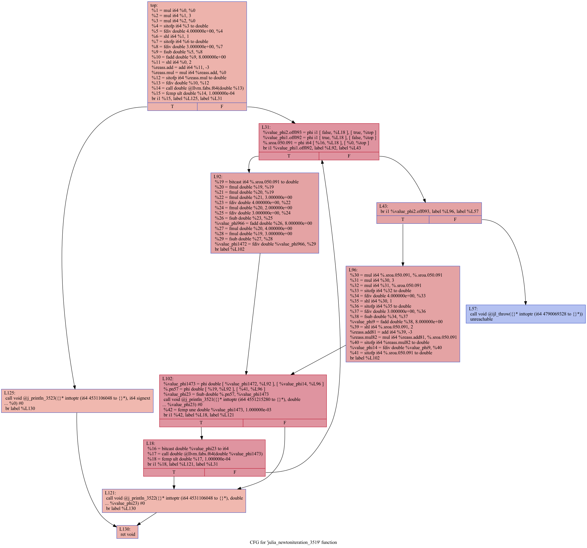
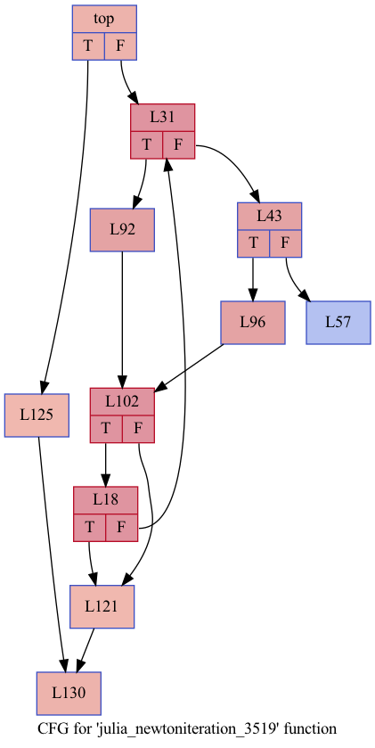

# Newton-Raphson: Julia to IR

In this tutorial, we will focus on the Newton-Raphson algorithm written in Julia and create IR for the algorithm.

The sample code for the Newton-Raphson algorithm, written in Julia, is given below:

```Julia
function f(x)
    4/3x^3 - 3/2x^2 +8
end
function g(x)
    4x^2 - 3x
end
function newtoniteration(x)
    h = f(x) / g(x)
    while abs(h) >= 0.0001
        h = f(x) / g(x)
        x = x - h
        println("Iterations : ", x)
    end
    println("The value of the root is : ", x)
end
x0 = 5
newtoniteration(x0)
```

As a next step, we will look at the LLVM-IR directly and not show the lexical and AST creation results.

To create LLVM IR we will use this code;

```julia
@code_llvm newtoniteration(5)
```

As seen in the code we define an initial value and while calculating according to the value LLVM -IR will be created. Results can see below:

```Julia
;  @ In[4]:7 within `newtoniteration`
define void @julia_newtoniteration_1296(i64 signext %0) #0 {
top:
;  @ In[4]:8 within `newtoniteration`
; ┌ @ In[4]:2 within `f`
; │┌ @ intfuncs.jl:321 within `literal_pow`
; ││┌ @ operators.jl:591 within `*` @ int.jl:88
     %1 = mul i64 %0, %0
     %2 = mul i64 %1, 3
; │└└
; │┌ @ int.jl:88 within `*`
    %3 = mul i64 %2, %0
; │└
; │┌ @ int.jl:97 within `/`
; ││┌ @ float.jl:269 within `float`
; │││┌ @ float.jl:243 within `AbstractFloat`
; ││││┌ @ float.jl:146 within `Float64`
       %4 = sitofp i64 %3 to double
; ││└└└
; ││ @ int.jl:97 within `/` @ float.jl:386
    %5 = fdiv double 4.000000e+00, %4
; │└
; │┌ @ int.jl:88 within `*`
    %6 = shl i64 %1, 1
; │└
; │┌ @ int.jl:97 within `/`
; ││┌ @ float.jl:269 within `float`
; │││┌ @ float.jl:243 within `AbstractFloat`
; ││││┌ @ float.jl:146 within `Float64`
       %7 = sitofp i64 %6 to double
; ││└└└
; ││ @ int.jl:97 within `/` @ float.jl:386
    %8 = fdiv double 3.000000e+00, %7
; │└
; │┌ @ float.jl:384 within `-`
    %9 = fsub double %5, %8
; │└
; │┌ @ promotion.jl:384 within `+` @ float.jl:383
    %10 = fadd double %9, 8.000000e+00
; └└
; ┌ @ In[4]:5 within `g`
; │┌ @ int.jl:88 within `*`
    %11 = shl i64 %0, 2
    %reass.add = add i64 %11, -3
; │└
; │┌ @ int.jl:86 within `-`
    %reass.mul = mul i64 %reass.add, %0
; └└
; ┌ @ promotion.jl:387 within `/`
; │┌ @ promotion.jl:355 within `promote`
; ││┌ @ promotion.jl:332 within `_promote`
; │││┌ @ number.jl:7 within `convert`
; ││││┌ @ float.jl:146 within `Float64`
       %12 = sitofp i64 %reass.mul to double
; │└└└└
; │ @ promotion.jl:387 within `/` @ float.jl:386
   %13 = fdiv double %10, %12
; └
;  @ In[4]:9 within `newtoniteration`
; ┌ @ float.jl:486 within `abs`
   %14 = call double @llvm.fabs.f64(double %13)
; └
; ┌ @ operators.jl:429 within `>=`
; │┌ @ float.jl:413 within `<=`
    %15 = fcmp ult double %14, 1.000000e-04
; └└
  br i1 %15, label %L125, label %L31

L18:                                              ; preds = %L102
  %16 = bitcast double %value_phi23 to i64
; ┌ @ float.jl:486 within `abs`
   %17 = call double @llvm.fabs.f64(double %value_phi1473)
; └
; ┌ @ operators.jl:429 within `>=`
; │┌ @ float.jl:413 within `<=`
    %18 = fcmp ult double %17, 1.000000e-04
; └└
  br i1 %18, label %L121, label %L31

L31:                                              ; preds = %L18, %top
  %value_phi2.off093 = phi i1 [ false, %L18 ], [ true, %top ]
  %value_phi1.off092 = phi i1 [ true, %L18 ], [ false, %top ]
  %.sroa.050.091 = phi i64 [ %16, %L18 ], [ %0, %top ]
;  @ In[4]:10 within `newtoniteration`
  br i1 %value_phi1.off092, label %L92, label %L43

L43:                                              ; preds = %L31
  br i1 %value_phi2.off093, label %L96, label %L57

L57:                                              ; preds = %L43
  call void @ijl_throw({}* inttoptr (i64 4790069328 to {}*))
  unreachable

L92:                                              ; preds = %L31
; ┌ @ In[4]:2 within `f`
; │┌ @ intfuncs.jl:321 within `literal_pow`
; ││┌ @ operators.jl:591 within `*` @ float.jl:385
     %19 = bitcast i64 %.sroa.050.091 to double
     %20 = fmul double %19, %19
     %21 = fmul double %20, %19
; │└└
; │┌ @ promotion.jl:385 within `*` @ float.jl:385
    %22 = fmul double %21, 3.000000e+00
; │└
; │┌ @ promotion.jl:387 within `/` @ float.jl:386
    %23 = fdiv double 4.000000e+00, %22
; │└
; │┌ @ promotion.jl:385 within `*` @ float.jl:385
    %24 = fmul double %20, 2.000000e+00
; │└
; │┌ @ promotion.jl:387 within `/` @ float.jl:386
    %25 = fdiv double 3.000000e+00, %24
; │└
; │┌ @ float.jl:384 within `-`
    %26 = fsub double %23, %25
; │└
; │┌ @ promotion.jl:384 within `+` @ float.jl:383
    %value_phi966 = fadd double %26, 8.000000e+00
; └└
; ┌ @ In[4]:5 within `g`
; │┌ @ promotion.jl:385 within `*` @ float.jl:385
    %27 = fmul double %20, 4.000000e+00
    %28 = fmul double %19, 3.000000e+00
; │└
; │┌ @ float.jl:384 within `-`
    %29 = fsub double %27, %28
; └└
;  @ In[4] within `newtoniteration`
  %value_phi1472 = fdiv double %value_phi966, %29
;  @ In[4]:11 within `newtoniteration`
  br label %L102

L96:                                              ; preds = %L43
;  @ In[4]:10 within `newtoniteration`
; ┌ @ In[4]:2 within `f`
; │┌ @ intfuncs.jl:321 within `literal_pow`
; ││┌ @ operators.jl:591 within `*` @ int.jl:88
     %30 = mul i64 %.sroa.050.091, %.sroa.050.091
     %31 = mul i64 %30, 3
; │└└
; │┌ @ int.jl:88 within `*`
    %32 = mul i64 %31, %.sroa.050.091
; │└
; │┌ @ int.jl:97 within `/`
; ││┌ @ float.jl:269 within `float`
; │││┌ @ float.jl:243 within `AbstractFloat`
; ││││┌ @ float.jl:146 within `Float64`
       %33 = sitofp i64 %32 to double
; ││└└└
; ││ @ int.jl:97 within `/` @ float.jl:386
    %34 = fdiv double 4.000000e+00, %33
; │└
; │┌ @ int.jl:88 within `*`
    %35 = shl i64 %30, 1
; │└
; │┌ @ int.jl:97 within `/`
; ││┌ @ float.jl:269 within `float`
; │││┌ @ float.jl:243 within `AbstractFloat`
; ││││┌ @ float.jl:146 within `Float64`
       %36 = sitofp i64 %35 to double
; ││└└└
; ││ @ int.jl:97 within `/` @ float.jl:386
    %37 = fdiv double 3.000000e+00, %36
; │└
; │┌ @ float.jl:384 within `-`
    %38 = fsub double %34, %37
; │└
; │┌ @ promotion.jl:384 within `+` @ float.jl:383
    %value_phi9 = fadd double %38, 8.000000e+00
; └└
; ┌ @ In[4]:5 within `g`
; │┌ @ int.jl:88 within `*`
    %39 = shl i64 %.sroa.050.091, 2
    %reass.add81 = add i64 %39, -3
; │└
; │┌ @ int.jl:86 within `-`
    %reass.mul82 = mul i64 %reass.add81, %.sroa.050.091
; └└
  %40 = sitofp i64 %reass.mul82 to double
;  @ In[4] within `newtoniteration`
  %value_phi14 = fdiv double %value_phi9, %40
;  @ In[4]:11 within `newtoniteration`
; ┌ @ promotion.jl:386 within `-`
; │┌ @ promotion.jl:355 within `promote`
; ││┌ @ promotion.jl:332 within `_promote`
; │││┌ @ number.jl:7 within `convert`
; ││││┌ @ float.jl:146 within `Float64`
       %41 = sitofp i64 %.sroa.050.091 to double
; └└└└└
  br label %L102

L102:                                             ; preds = %L96, %L92
  %value_phi1473 = phi double [ %value_phi1472, %L92 ], [ %value_phi14, %L96 ]
  %.pn57 = phi double [ %19, %L92 ], [ %41, %L96 ]
;  @ In[4] within `newtoniteration`
  %value_phi23 = fsub double %.pn57, %value_phi1473
;  @ In[4]:12 within `newtoniteration`
  call void @j_println_1298({}* inttoptr (i64 4551215280 to {}*), double %value_phi23) #0
;  @ In[4]:13 within `newtoniteration`
; ┌ @ float.jl:410 within `==`
   %42 = fcmp une double %value_phi1473, 1.000000e-03
; └
  br i1 %42, label %L18, label %L121

L121:                                             ; preds = %L102, %L18
;  @ In[4]:17 within `newtoniteration`
  call void @j_println_1299({}* inttoptr (i64 4531106048 to {}*), double %value_phi23) #0
  br label %L130

L125:                                             ; preds = %top
  call void @j_println_1300({}* inttoptr (i64 4531106048 to {}*), i64 signext %0) #0
  br label %L130

L130:                                             ; preds = %L125, %L121
  ret void
}
```

LLVM-IR representation of the Julia is more optimized than other high level programming languages.

## Visualization of the IR

To visualize the IR we will use the "ShowCode" package because its easy to represent. To install the package from github you need to use this commend given below:

```Julia
pkg"add https://github.com/tkf/ShowCode.jl"
```

For the LLVM IR results with ShowCode we can use these commands and create valid IR:

```julia
c = @sc_llvm f(args...)

c                  # view IR in the REPL
display(c)         # (ditto)
edit(c)            # open the IR in editor
print(c)           # print the IR
abspath(c)         # file path to the text containing the IR

c.native           # create native code explore
c.att              # (ditto)
c.intel            # create native code explore in intel syntax
eidt(c.native)
abspath(c.native)

c.cfg              # control-flow graph (CFG) visualizer
display(c.cfg)     # display CFG
edit(c.cfg.png)    # open PNG file in your editor
edit(c.cfg.svg)    # same for SVG
abspath(c.cfg.png) # file path to the PNG image
c.cfg_only
c.dom
```

To visualize the LLVM IR we will use the `display(c.cfg)` and we will get:



Beside these detailed version of it we can create less detailed version with using `c.cfg_only` command and the results will be;



As seen on the results it could be usefull to see the overall program flow easily.
