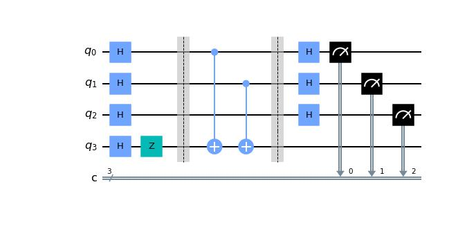
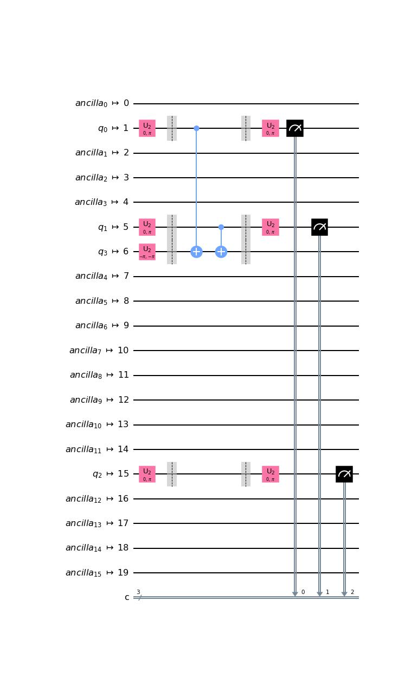
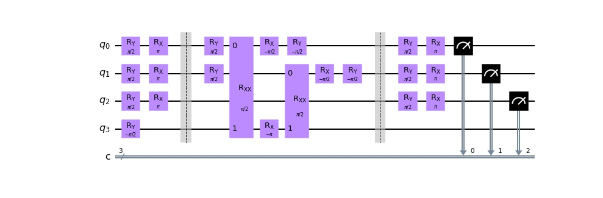

# AQT IonTrap LLVM vs IBM Superconducting LLVM

Here is our untranspiled Bernstein Vazirani circuit for a 3 bit hidden string s.


## Qiskit to LLVM using IBM Superconducting Qubits

1. **Transpilation Optimization_Level=3 with 20 Qubit, Simulated Boebligen Superconducting Backend.**


2. **Transpiled circuit to OpenQASM3.**

``` Python
OPENQASM 3;
include "stdgates.inc";
bit[3] c;
u2(0, pi) $0;
u2(0, pi) $11;
u2(0, pi) $15;
u2(-pi, -pi) $16;
barrier $11, $15, $0, $16;
cx $11, $16;
cx $15, $16;
barrier $11, $15, $0, $16;
u2(0, pi) $0;
u2(0, pi) $11;
u2(0, pi) $15;
c[0] = measure $11;
c[1] = measure $15;
c[2] = measure $0;
```

3.**OpenQASM3 to LLVM.**

In QCOR execute, `qcor-mlir-tool  -emit=llvm  B-V_transpiled_Superconducting_qc3.qasm`

Note: You will need to modify your OpenQASM3 file first so that it is QCOR compatible.

1. The original OpenQASM file is located **[HERE](B-V_transpiled_Superconducting_qc3.qasm).**
2. The QCOR compatible OpenQASM file is located **[HERE](IonTrap_and_Superconducting_llvm/QCOR_Compatible_B-V_transpiled_Superconducting_qc3.qasm).**

``` Python
; ModuleID = 'LLVMDialectModule'
source_filename = "LLVMDialectModule"

%qreg = type opaque
%Array = type opaque
%Result = type opaque
%Qubit = type opaque

declare i8* @malloc(i64 %0)

declare void @free(i8* %0)

declare void @__quantum__rt__set_external_qreg(%qreg* %0)

declare void @__quantum__rt__qubit_release_array(%Array* %0)

declare %Result* @__quantum__qis__mz(%Qubit* %0)

declare void @__quantum__qis__cnot(%Qubit* %0, %Qubit* %1)

declare void @__quantum__qis__u2(double %0, double %1, %Qubit* %2)

declare i8* @__quantum__rt__array_get_element_ptr_1d(%Array* %0, i64 %1)

declare %Array* @__quantum__rt__qubit_allocate_array(i64 %0)

declare void @__quantum__rt__finalize()

declare i32 @__quantum__rt__initialize(i32 %0, i8** %1)

define i32 @main(i32 %0, i8** %1) {
  %3 = call i32 @__quantum__rt__initialize(i32 %0, i8** %1)
  %4 = call i32 @__internal_mlir_B-V_transpiled_Superconducting_qc3()
  call void @__quantum__rt__finalize()
  ret i32 %4
}

define i32 @__internal_mlir_B-V_transpiled_Superconducting_qc3() {
  %1 = call %Array* @__quantum__rt__qubit_allocate_array(i64 20)
  %2 = alloca i1, i64 mul (i64 ptrtoint (i1* getelementptr (i1, i1* null, i32 1) to i64), i64 3), align 1
  %3 = insertvalue { i1*, i1*, i64, [1 x i64], [1 x i64] } undef, i1* %2, 0
  %4 = insertvalue { i1*, i1*, i64, [1 x i64], [1 x i64] } %3, i1* %2, 1
  %5 = insertvalue { i1*, i1*, i64, [1 x i64], [1 x i64] } %4, i64 0, 2
  %6 = insertvalue { i1*, i1*, i64, [1 x i64], [1 x i64] } %5, i64 3, 3, 0
  %7 = insertvalue { i1*, i1*, i64, [1 x i64], [1 x i64] } %6, i64 1, 4, 0
  %8 = extractvalue { i1*, i1*, i64, [1 x i64], [1 x i64] } %7, 1
  %9 = getelementptr i1, i1* %8, i64 0
  store i1 false, i1* %9, align 1
  %10 = extractvalue { i1*, i1*, i64, [1 x i64], [1 x i64] } %7, 1
  %11 = getelementptr i1, i1* %10, i64 1
  store i1 false, i1* %11, align 1
  %12 = extractvalue { i1*, i1*, i64, [1 x i64], [1 x i64] } %7, 1
  %13 = getelementptr i1, i1* %12, i64 2
  store i1 false, i1* %13, align 1
  %14 = call i8* @__quantum__rt__array_get_element_ptr_1d(%Array* %1, i64 0)
  %15 = bitcast i8* %14 to %Qubit**
  %16 = load %Qubit*, %Qubit** %15, align 8
  call void @__quantum__qis__u2(double 0.000000e+00, double 0x400921FB54442D18, %Qubit* %16)
  %17 = call i8* @__quantum__rt__array_get_element_ptr_1d(%Array* %1, i64 11)
  %18 = bitcast i8* %17 to %Qubit**
  %19 = load %Qubit*, %Qubit** %18, align 8
  call void @__quantum__qis__u2(double 0.000000e+00, double 0x400921FB54442D18, %Qubit* %19)
  %20 = call i8* @__quantum__rt__array_get_element_ptr_1d(%Array* %1, i64 15)
  %21 = bitcast i8* %20 to %Qubit**
  %22 = load %Qubit*, %Qubit** %21, align 8
  call void @__quantum__qis__u2(double 0.000000e+00, double 0x400921FB54442D18, %Qubit* %22)
  %23 = call i8* @__quantum__rt__array_get_element_ptr_1d(%Array* %1, i64 16)
  %24 = bitcast i8* %23 to %Qubit**
  %25 = load %Qubit*, %Qubit** %24, align 8
  call void @__quantum__qis__u2(double 0xC00921FB54442D18, double 0xC00921FB54442D18, %Qubit* %25)
  call void @__quantum__qis__cnot(%Qubit* %19, %Qubit* %25)
  call void @__quantum__qis__cnot(%Qubit* %22, %Qubit* %25)
  call void @__quantum__qis__u2(double 0.000000e+00, double 0x400921FB54442D18, %Qubit* %16)
  call void @__quantum__qis__u2(double 0.000000e+00, double 0x400921FB54442D18, %Qubit* %19)
  call void @__quantum__qis__u2(double 0.000000e+00, double 0x400921FB54442D18, %Qubit* %22)
  %26 = call %Result* @__quantum__qis__mz(%Qubit* %19)
  %27 = bitcast %Result* %26 to i1*
  %28 = load i1, i1* %27, align 1
  %29 = extractvalue { i1*, i1*, i64, [1 x i64], [1 x i64] } %7, 1
  %30 = getelementptr i1, i1* %29, i64 0
  store i1 %28, i1* %30, align 1
  %31 = call %Result* @__quantum__qis__mz(%Qubit* %22)
  %32 = bitcast %Result* %31 to i1*
  %33 = load i1, i1* %32, align 1
  %34 = extractvalue { i1*, i1*, i64, [1 x i64], [1 x i64] } %7, 1
  %35 = getelementptr i1, i1* %34, i64 1
  store i1 %33, i1* %35, align 1
  %36 = call %Result* @__quantum__qis__mz(%Qubit* %16)
  %37 = bitcast %Result* %36 to i1*
  %38 = load i1, i1* %37, align 1
  %39 = extractvalue { i1*, i1*, i64, [1 x i64], [1 x i64] } %7, 1
  %40 = getelementptr i1, i1* %39, i64 2
  store i1 %38, i1* %40, align 1
  call void @__quantum__rt__qubit_release_array(%Array* %1)
  ret i32 0
}

define i32 @B-V_transpiled_Superconducting_qc3(%qreg* %0) {
  call void @__quantum__rt__set_external_qreg(%qreg* %0)
  %2 = call i32 @__internal_mlir_B-V_transpiled_Superconducting_qc3()
  call void @__quantum__rt__finalize()
  ret i32 %2
}

!llvm.dbg.cu = !{!0}
!llvm.module.flags = !{!2}

!0 = distinct !DICompileUnit(language: DW_LANG_C, file: !1, producer: "mlir", isOptimized: true, runtimeVersion: 0, emissionKind: FullDebug)
!1 = !DIFile(filename: "LLVMDialectModule", directory: "/")
!2 = !{i32 2, !"Debug Info Version", i32 3}
```

**(Optional) OpenQasm to MLIR**

In QCOR execute, `qcor-mlir-tool  -emit=mlir  B-V_transpiled_Superconducting_qc3.qasm`

MLIR file is **[HERE](IonTrap_and_Superconducting_llvm/B-V_transpiled_Superconducting_qc3.mlir).**

**(Optional) OpenQasm to LLVM-MLIR**

In QCOR execute, `qcor-mlir-tool  -emit=llvm-mlir  B-V_transpiled_Superconducting_qc3.qasm`

LLVM-MLIR file is **[HERE](IonTrap_and_Superconducting_llvm/B-V_transpiled_Superconducting_qc3-ll.mlir).**

## Qiskit to LLVM using AQT IonTrap Qubits  

1. **Transpilation Optimization_Level=3 with 11 Qubit, Noisy Ion Trap Simulated Backend.**


2. **Transpiled circuit to OpenQASM3.**

``` Python
OPENQASM 3;
include "stdgates.inc";
gate rxx_1693535957680(_gate_p_0) _gate_q_0, _gate_q_1 {
  h _gate_q_0;
  h _gate_q_1;
  cx _gate_q_0, _gate_q_1;
  rz(pi/2) _gate_q_1;
  cx _gate_q_0, _gate_q_1;
  h _gate_q_1;
  h _gate_q_0;
}
gate rxx_1693535959120(_gate_p_0) _gate_q_0, _gate_q_1 {
  h _gate_q_0;
  h _gate_q_1;
  cx _gate_q_0, _gate_q_1;
  rz(pi/2) _gate_q_1;
  cx _gate_q_0, _gate_q_1;
  h _gate_q_1;
  h _gate_q_0;
}
bit[3] c;
qubit[4] _all_qubits;
let q = _all_qubits[0:3];
ry(pi/2) q[0];
rx(pi) q[0];
ry(pi/2) q[1];
rx(pi) q[1];
ry(pi/2) q[2];
rx(pi) q[2];
ry(-pi/2) q[3];
barrier q[0], q[1], q[2], q[3];
ry(pi/2) q[0];
rxx_1693535957680(pi/2) q[0], q[3];
rx(-pi/2) q[0];
ry(-pi/2) q[0];
ry(pi/2) q[1];
rx(-pi) q[3];
rxx_1693535959120(pi/2) q[1], q[3];
rx(-pi/2) q[1];
ry(-pi/2) q[1];
barrier q[0], q[1], q[2], q[3];
ry(pi/2) q[0];
rx(pi) q[0];
ry(pi/2) q[1];
rx(pi) q[1];
ry(pi/2) q[2];
rx(pi) q[2];
c[0] = measure q[0];
c[1] = measure q[1];
c[2] = measure q[2];
```

3.**OpenQASM3 to LLVM.**

In QCOR execute, `qcor-mlir-tool  -emit=llvm  B-V_transpiled_IonTrap_qc3.qasm`

Note: You will need to modify your OpenQASM3 file first so that it is QCOR compatible.

1. The original OpenQASM file is located **[HERE](B-V_transpiled_IonTrap_qc3.qasm).**
2. The QCOR compatible OpenQASM file is located **[HERE](IonTrap_and_Superconducting_llvm/QCOR_Compatible_B-V_transpiled_IonTrap_qc3.qasm).**

``` Python
; ModuleID = 'LLVMDialectModule'
source_filename = "LLVMDialectModule"

%Qubit = type opaque
%qreg = type opaque
%Array = type opaque
%Result = type opaque
%Range = type { i64, i64, i64 }

declare i8* @malloc(i64 %0)

declare void @free(i8* %0)

declare void @__quantum__qis__rz(double %0, %Qubit* %1)

declare void @__quantum__qis__cnot(%Qubit* %0, %Qubit* %1)

declare void @__quantum__qis__h(%Qubit* %0)

declare void @__quantum__rt__set_external_qreg(%qreg* %0)

declare void @__quantum__rt__qubit_release_array(%Array* %0)

declare %Result* @__quantum__qis__mz(%Qubit* %0)

declare void @__quantum__qis__rx(double %0, %Qubit* %1)

declare void @__quantum__qis__ry(double %0, %Qubit* %1)

declare i8* @__quantum__rt__array_get_element_ptr_1d(%Array* %0, i64 %1)

declare %Array* @__quantum__rt__array_slice(%Array* %0, i32 %1, %Range %2)

declare %Array* @__quantum__rt__qubit_allocate_array(i64 %0)

declare void @__quantum__rt__finalize()

declare i32 @__quantum__rt__initialize(i32 %0, i8** %1)

define i32 @main(i32 %0, i8** %1) {
  %3 = call i32 @__quantum__rt__initialize(i32 %0, i8** %1)
  %4 = call i32 @__internal_mlir_B-V_transpiled_IonTrap_qc3()
  call void @__quantum__rt__finalize()
  ret i32 %4
}

define i32 @__internal_mlir_B-V_transpiled_IonTrap_qc3() {
  %1 = alloca i1, i64 mul (i64 ptrtoint (i1* getelementptr (i1, i1* null, i32 1) to i64), i64 3), align 1
  %2 = insertvalue { i1*, i1*, i64, [1 x i64], [1 x i64] } undef, i1* %1, 0
  %3 = insertvalue { i1*, i1*, i64, [1 x i64], [1 x i64] } %2, i1* %1, 1
  %4 = insertvalue { i1*, i1*, i64, [1 x i64], [1 x i64] } %3, i64 0, 2
  %5 = insertvalue { i1*, i1*, i64, [1 x i64], [1 x i64] } %4, i64 3, 3, 0
  %6 = insertvalue { i1*, i1*, i64, [1 x i64], [1 x i64] } %5, i64 1, 4, 0
  %7 = extractvalue { i1*, i1*, i64, [1 x i64], [1 x i64] } %6, 1
  %8 = getelementptr i1, i1* %7, i64 0
  store i1 false, i1* %8, align 1
  %9 = extractvalue { i1*, i1*, i64, [1 x i64], [1 x i64] } %6, 1
  %10 = getelementptr i1, i1* %9, i64 1
  store i1 false, i1* %10, align 1
  %11 = extractvalue { i1*, i1*, i64, [1 x i64], [1 x i64] } %6, 1
  %12 = getelementptr i1, i1* %11, i64 2
  store i1 false, i1* %12, align 1
  %13 = call %Array* @__quantum__rt__qubit_allocate_array(i64 4)
  %14 = call %Array* @__quantum__rt__array_slice(%Array* %13, i32 0, %Range { i64 0, i64 1, i64 3 })
  %15 = call i8* @__quantum__rt__array_get_element_ptr_1d(%Array* %13, i64 0)
  %16 = bitcast i8* %15 to %Qubit**
  %17 = load %Qubit*, %Qubit** %16, align 8
  %18 = call i8* @__quantum__rt__array_get_element_ptr_1d(%Array* %13, i64 1)
  %19 = bitcast i8* %18 to %Qubit**
  %20 = load %Qubit*, %Qubit** %19, align 8
  %21 = call i8* @__quantum__rt__array_get_element_ptr_1d(%Array* %13, i64 2)
  %22 = bitcast i8* %21 to %Qubit**
  %23 = load %Qubit*, %Qubit** %22, align 8
  %24 = call i8* @__quantum__rt__array_get_element_ptr_1d(%Array* %13, i64 3)
  %25 = bitcast i8* %24 to %Qubit**
  %26 = load %Qubit*, %Qubit** %25, align 8
  call void @__quantum__qis__ry(double 0x3FF921FB54442D18, %Qubit* %17)
  call void @__quantum__qis__rx(double 0x400921FB54442D18, %Qubit* %17)
  call void @__quantum__qis__ry(double 0x3FF921FB54442D18, %Qubit* %20)
  call void @__quantum__qis__rx(double 0x400921FB54442D18, %Qubit* %20)
  call void @__quantum__qis__ry(double 0x3FF921FB54442D18, %Qubit* %23)
  call void @__quantum__qis__rx(double 0x400921FB54442D18, %Qubit* %23)
  call void @__quantum__qis__ry(double 0xBFF921FB54442D18, %Qubit* %26)
  call void @__quantum__qis__ry(double 0x3FF921FB54442D18, %Qubit* %17)
  call void @__quantum__qis__h(%Qubit* %17), !dbg !3
  call void @__quantum__qis__h(%Qubit* %26), !dbg !10
  call void @__quantum__qis__cnot(%Qubit* %17, %Qubit* %26), !dbg !11
  call void @__quantum__qis__rz(double 0x3FF921FB54442D18, %Qubit* %26), !dbg !12
  call void @__quantum__qis__cnot(%Qubit* %17, %Qubit* %26), !dbg !13
  call void @__quantum__qis__h(%Qubit* %26), !dbg !14
  call void @__quantum__qis__h(%Qubit* %17), !dbg !15
  %27 = insertvalue { double, %Qubit*, %Qubit* } { double 0x3FF921FB54442D18, %Qubit* undef, %Qubit* undef }, %Qubit* %17, 1
  %28 = insertvalue { double, %Qubit*, %Qubit* } %27, %Qubit* %26, 2
  %29 = extractvalue { double, %Qubit*, %Qubit* } %28, 0
  %30 = extractvalue { double, %Qubit*, %Qubit* } %28, 1
  %31 = extractvalue { double, %Qubit*, %Qubit* } %28, 2
  call void @__quantum__qis__rx(double 0xBFF921FB54442D18, %Qubit* %17)
  call void @__quantum__qis__ry(double 0xBFF921FB54442D18, %Qubit* %17)
  call void @__quantum__qis__ry(double 0x3FF921FB54442D18, %Qubit* %20)
  call void @__quantum__qis__rx(double 0xC00921FB54442D18, %Qubit* %26)
  call void @__quantum__qis__h(%Qubit* %20), !dbg !16
  call void @__quantum__qis__h(%Qubit* %26), !dbg !19
  call void @__quantum__qis__cnot(%Qubit* %20, %Qubit* %26), !dbg !20
  call void @__quantum__qis__rz(double 0x3FF921FB54442D18, %Qubit* %26), !dbg !21
  call void @__quantum__qis__cnot(%Qubit* %20, %Qubit* %26), !dbg !22
  call void @__quantum__qis__h(%Qubit* %26), !dbg !23
  call void @__quantum__qis__h(%Qubit* %20), !dbg !24
  %32 = insertvalue { double, %Qubit*, %Qubit* } { double 0x3FF921FB54442D18, %Qubit* undef, %Qubit* undef }, %Qubit* %20, 1
  %33 = insertvalue { double, %Qubit*, %Qubit* } %32, %Qubit* %26, 2
  %34 = extractvalue { double, %Qubit*, %Qubit* } %33, 0
  %35 = extractvalue { double, %Qubit*, %Qubit* } %33, 1
  %36 = extractvalue { double, %Qubit*, %Qubit* } %33, 2
  call void @__quantum__qis__rx(double 0xBFF921FB54442D18, %Qubit* %20)
  call void @__quantum__qis__ry(double 0xBFF921FB54442D18, %Qubit* %20)
  call void @__quantum__qis__ry(double 0x3FF921FB54442D18, %Qubit* %17)
  call void @__quantum__qis__rx(double 0x400921FB54442D18, %Qubit* %17)
  call void @__quantum__qis__ry(double 0x3FF921FB54442D18, %Qubit* %20)
  call void @__quantum__qis__rx(double 0x400921FB54442D18, %Qubit* %20)
  call void @__quantum__qis__ry(double 0x3FF921FB54442D18, %Qubit* %23)
  call void @__quantum__qis__rx(double 0x400921FB54442D18, %Qubit* %23)
  %37 = call %Result* @__quantum__qis__mz(%Qubit* %17)
  %38 = bitcast %Result* %37 to i1*
  %39 = load i1, i1* %38, align 1
  %40 = extractvalue { i1*, i1*, i64, [1 x i64], [1 x i64] } %6, 1
  %41 = getelementptr i1, i1* %40, i64 0
  store i1 %39, i1* %41, align 1
  %42 = call %Result* @__quantum__qis__mz(%Qubit* %20)
  %43 = bitcast %Result* %42 to i1*
  %44 = load i1, i1* %43, align 1
  %45 = extractvalue { i1*, i1*, i64, [1 x i64], [1 x i64] } %6, 1
  %46 = getelementptr i1, i1* %45, i64 1
  store i1 %44, i1* %46, align 1
  %47 = call %Result* @__quantum__qis__mz(%Qubit* %23)
  %48 = bitcast %Result* %47 to i1*
  %49 = load i1, i1* %48, align 1
  %50 = extractvalue { i1*, i1*, i64, [1 x i64], [1 x i64] } %6, 1
  %51 = getelementptr i1, i1* %50, i64 2
  store i1 %49, i1* %51, align 1
  call void @__quantum__rt__qubit_release_array(%Array* %13)
  ret i32 0
}

define i32 @B-V_transpiled_IonTrap_qc3(%qreg* %0) {
  call void @__quantum__rt__set_external_qreg(%qreg* %0)
  %2 = call i32 @__internal_mlir_B-V_transpiled_IonTrap_qc3()
  call void @__quantum__rt__finalize()
  ret i32 %2
}

define { double, %Qubit*, %Qubit* } @rxx_1693535957680(double %0, %Qubit* %1, %Qubit* %2) !dbg !6 {
  call void @__quantum__qis__h(%Qubit* %1), !dbg !3
  call void @__quantum__qis__h(%Qubit* %2), !dbg !10
  call void @__quantum__qis__cnot(%Qubit* %1, %Qubit* %2), !dbg !11
  call void @__quantum__qis__rz(double 0x3FF921FB54442D18, %Qubit* %2), !dbg !12
  call void @__quantum__qis__cnot(%Qubit* %1, %Qubit* %2), !dbg !13
  call void @__quantum__qis__h(%Qubit* %2), !dbg !14
  call void @__quantum__qis__h(%Qubit* %1), !dbg !15
  %4 = insertvalue { double, %Qubit*, %Qubit* } undef, double %0, 0
  %5 = insertvalue { double, %Qubit*, %Qubit* } %4, %Qubit* %1, 1
  %6 = insertvalue { double, %Qubit*, %Qubit* } %5, %Qubit* %2, 2
  ret { double, %Qubit*, %Qubit* } %6
}

define { double, %Qubit*, %Qubit* } @rxx_1693535959120(double %0, %Qubit* %1, %Qubit* %2) !dbg !18 {
  call void @__quantum__qis__h(%Qubit* %1), !dbg !16
  call void @__quantum__qis__h(%Qubit* %2), !dbg !19
  call void @__quantum__qis__cnot(%Qubit* %1, %Qubit* %2), !dbg !20
  call void @__quantum__qis__rz(double 0x3FF921FB54442D18, %Qubit* %2), !dbg !21
  call void @__quantum__qis__cnot(%Qubit* %1, %Qubit* %2), !dbg !22
  call void @__quantum__qis__h(%Qubit* %2), !dbg !23
  call void @__quantum__qis__h(%Qubit* %1), !dbg !24
  %4 = insertvalue { double, %Qubit*, %Qubit* } undef, double %0, 0
  %5 = insertvalue { double, %Qubit*, %Qubit* } %4, %Qubit* %1, 1
  %6 = insertvalue { double, %Qubit*, %Qubit* } %5, %Qubit* %2, 2
  ret { double, %Qubit*, %Qubit* } %6
}

!llvm.dbg.cu = !{!0}
!llvm.module.flags = !{!2}

!0 = distinct !DICompileUnit(language: DW_LANG_C, file: !1, producer: "mlir", isOptimized: true, runtimeVersion: 0, emissionKind: FullDebug)
!1 = !DIFile(filename: "LLVMDialectModule", directory: "/")
!2 = !{i32 2, !"Debug Info Version", i32 3}
!3 = !DILocation(line: 4, column: 2, scope: !4)
!4 = !DILexicalBlockFile(scope: !6, file: !5, discriminator: 0)
!5 = !DIFile(filename: "B-V_transpiled_IonTrap_qc3", directory: "/home/coder/PIRQ")
!6 = distinct !DISubprogram(name: "rxx_1693535957680", linkageName: "rxx_1693535957680", scope: null, file: !7, type: !8, spFlags: DISPFlagDefinition | DISPFlagOptimized, unit: !0, retainedNodes: !9)
!7 = !DIFile(filename: "<unknown>", directory: "/home/coder/PIRQ")
!8 = !DISubroutineType(types: !9)
!9 = !{}
!10 = !DILocation(line: 5, column: 2, scope: !4)
!11 = !DILocation(line: 6, column: 2, scope: !4)
!12 = !DILocation(line: 7, column: 2, scope: !4)
!13 = !DILocation(line: 8, column: 2, scope: !4)
!14 = !DILocation(line: 9, column: 2, scope: !4)
!15 = !DILocation(line: 10, column: 2, scope: !4)
!16 = !DILocation(line: 13, column: 2, scope: !17)
!17 = !DILexicalBlockFile(scope: !18, file: !5, discriminator: 0)
!18 = distinct !DISubprogram(name: "rxx_1693535959120", linkageName: "rxx_1693535959120", scope: null, file: !7, type: !8, spFlags: DISPFlagDefinition | DISPFlagOptimized, unit: !0, retainedNodes: !9)
!19 = !DILocation(line: 14, column: 2, scope: !17)
!20 = !DILocation(line: 15, column: 2, scope: !17)
!21 = !DILocation(line: 16, column: 2, scope: !17)
!22 = !DILocation(line: 17, column: 2, scope: !17)
!23 = !DILocation(line: 18, column: 2, scope: !17)
!24 = !DILocation(line: 19, column: 2, scope: !17)
```

**(Optional) OpenQasm to MLIR**

In QCOR execute, `qcor-mlir-tool  -emit=mlir  B-V_transpiled_IonTrap_qc3.qasm`

MLIR file is **[HERE](IonTrap_and_Superconducting_llvm/B-V_transpiled_IonTrap_qc3.mlir).**

**(Optional) OpenQasm to LLVM-MLIR**

In QCOR execute, `qcor-mlir-tool  -emit=llvm-mlir  B-V_transpiled_IonTrap_qc3.qasm`

LLVM-MLIR file is **[HERE](IonTrap_and_Superconducting_llvm/B-V_transpiled_IonTrap_qc3-ll.mlir).**
