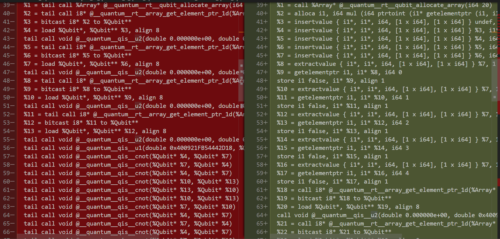
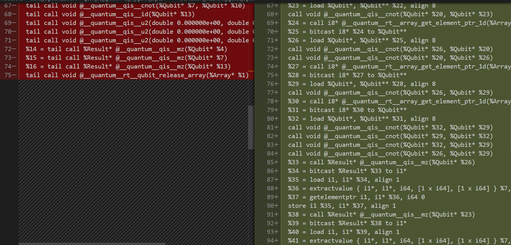

# Optimization in qcor vs. Qiskit

This document will examine the differences between the optimization processes by the qcor compiler and the Qiskit Terra trranspiler. We begin from the same basic Qiskit circuit, the Bernstein-Vazirani algorithm we explored in the [initial explanation](../Transpilation_Process_Gate_Optimization.ipynb) of transpilation:

``` Python
s = '011'   # the hidden binary string
n = 3 # number of bits used to represent s


# We need a circuit with n qubits, plus one auxiliary qubit
# We also need n classical bits to write the output to
qc = QuantumCircuit(n+1, n)

# Put auxiliary in the minus state |->
# We leave the other n qubits in just |0>
qc.h(n)
qc.z(n)

# Apply Hadamard gates to each of the n "main" qubits (excluding the auxiliary)
# before querying the oracle
for i in range(n):
    qc.h(i)
    
# Apply barrier
qc.barrier()

# Apply the inner-product oracle
s = s[::-1] # reverse s to fit qiskit's qubit ordering
for q in range(n):
    if s[q] == '0':
        qc.i(q)
    else:
        qc.cx(q, n)
        
# Apply barrier
qc.barrier()

# Apply Hadamard gates after querying the oracle
for i in range(n):
    qc.h(i)


# Measurement
for i in range(n):
    qc.measure(i, i)
```

From here, we took three different paths to generating the MLIR and LLVM files:

1. No optimization whatsoever. These files can be found in the [B_V_no_opt](B_V_no_opt) directory. For this path, we used the following commands:

+ `transpiled_qc0 = transpile(qc, backend, optimization_level = 0)`
+ `qasm3.dump(transpiled_qc0, "bernstein_vazirani_no_opt.qasm)`
+ `qcor-mlir-tool -emit=<value> bernstein_vazirani_no_opt.qasm`
    + `value` can be either `llvm`, `mlir`, or `mlir-llvm`

2. Maximum Qiskit optimization, found in [B_V_qiskit_opt3](B_V_qiskit_opt3). All optimization happened in the first step (transpilation):

+ `transpiled_qc3 = transpile(qc, backend, optimization_level = 3)`
+ `qasm3.dump(transpiled_qc0, "bernstein_vazirani_qiskit_opt.qasm)`
+ `qcor-mlir-tool -emit=<value> bernstein_vazirani_qiskit_opt.qasm`

3. Maximim qcor optimization, found in [B_V_qcor_opt3](B_V_qcor_opt3). All optimization happened in the last step (MLIR/LLVM Generation):

+ `transpiled_qc0 = transpile(qc, backend, optimization_level = 0)`
+ `qasm3.dump(transpiled_qc0, "bernstein_vazirani_qcor_opt.qasm)`
+ `qcor-mlir-tool -O3 -q-optimize -emit=<value> bernstein_vazirani_qcor_opt.qasm`

(Maybe add in future fourth path for both qiskit and qcor level 3 opt?)

Below, we will go over some of the main differences, looking at the MLIR and LLVM files. If you are interested in more fine details, or want to extend this analysis to the MLIR-LLVM files (marked as -ll.mlir), the files are attached for your personal investigation.

## MLIR

Here are some basic stats:

|   Stat     | qcor opt | Qiskit opt |
|----------------|----------|------------|
| File Size (kB) | 3        | 4          |
| Lines          | 67       |  79 |
| SSA Local Vars* | 31 | 30 |
| CX  | 11 | 8 |
| u1 | 1 | 0 |
| u2 | 7 | 1 |

(* The Local Vars are counted from only the `__internal_mlir` function and do not include constants)

As can be seen from this baseline analysis, the qcor optimization process seems to cut down on raw size. However, even though the flag `-q-optimize` allegedly will "Turn on MLIR-level quantum instruction optimizations" (from `qcor-mlir-tool -h`), qcor does not seem to reduce CX gates or circuit depth at all. There 11 CX gates in the OpenQASM source, and there are still 11 in the MLIR. Perhaps that will occur in the next pass (as we go to LLVM).

Next, we'll look at some informative chunks of the raw MLIR file. First, the `main` and `Bernstein_Vazirani` global functions are basically identical, so we can omit them and focus purely on the generated `__internal_mlir` function.

The first thing to note (which is also noticeable in the generated OpenQASM files) is that the Qiskit level 3 transpilation utilizes 5 classical bits for some reason, while transpiling at level 0 and optimizing through qcor uses only the default 3.

Besides for this, the lengthiness of the Qiskit-optimized MLIR comes mostly due to its inefficient use of constants and indices. The qcor-optimized MLIR creates constants for the value `false` (presumably a 0 of type i1), 0-3 as i64 (`long`s in C/C++), 0 as an i32 (just normal `int` in C/C++), 0-2 as datatype "index", and 0 and pi as f64 (`double`) types. This is a total of 11 constants, and this is all the program needs. In contrast, the Qiskit MLIR has 20 constants defined. Some of this comes from the fact that it needs 5 index variables instead of three, due to its use of an array of 5 classical bits. However, it also defines 3 and 8 as i64 types twice, and performs numerous i64 -> index casts.

In summary, at the MLIR level the Qiskit optimizations seem to take quantum considerations into account, while the qcor optimizations are probably just wrappers to pre-built clang optimizations. They seem to make the MLIR prettier, more readable, more organized, and more concise, but do not pay much attention at all to quantum concerns such as decoherence times or connectivity. To an extent, this was predictable because the Qiskit transpiler is "hardware aware" while the qcor compiler is not, so it has more information (like connectivity pairings) to work with.


## LLVM

Again, we will begin with basic stats.

|   Stat     | qcor opt | Qiskit opt |
|----------------|----------|------------|
| File Size (kB) | 5        | 6          |
| Lines          | 91       |  131 |
| SSA Local Vars* | 13 | 57 |
| CX  | 11 | 8 |
| u1 | 1 | 0 |
| u2 | 7 | 1 |

Note that the gate counts stayed exactly the same. We conclude that no gate optimizations are performed by the qcor-mlir-tool. We do note, however, that the actual qcor compiler (for C++) has the flag `-opt OPT              specify level of quantum circuit optimization (1 or 2)`, which may be worth further investigation.

The LLVM analysis agrees with the conclusions from the MLIR analysis. Visually, the qcor optimized LLVM is much more organized, with everything being set up in 10-15 lines and then a solid block of calls to the quantum runtime. In contrast, the Qiskit-optimized LLVM is disorganized, with pointers being manipulated and casts being performed in between quantum operations.



As you can probably guess, the qcor version is on the left and Qiskit is on the right. Further, inefficiencies in the SSA of Qiskit cause it to be much, much longer, with the bulk of the extraneous instructions being alignments, bitcasts, and other low level corrections due to not being set up as efficiently as the qcor version.



From this analysis, our recommendation is that quantum programs not rely on qcor's MLIR/LLVM generation optimization. While it may be helpful in reducing code size and managing classical resources such as memory, it is not concerned with quantum-specific concerns. For that, programs should be run through Qiskit's transpiler, perhaps qcor's C++ compiler, or some other similar tool.
