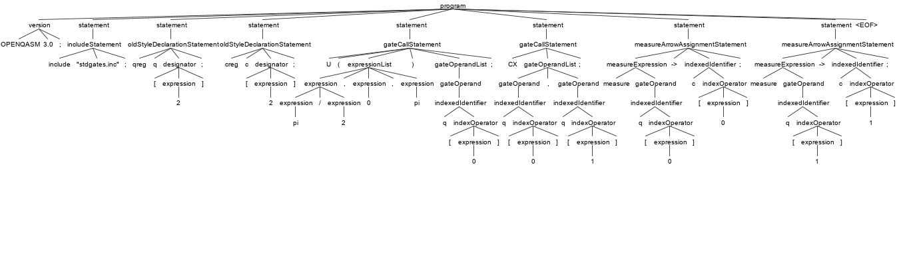

# Quantum Lexical Analysis and Parse Trees

This section explains [how OpenQASM uses the ANTLR4 tool](https://github.com/openqasm/openqasm/tree/main/source/grammar) to generate a lexer and parser for their high-level imperative programming language. We use this as an example for how quantum concepts and constructs can be supported through the compilation process, starting from the most foundational step: tokens and grammars.

### Sample OpenQASM Code.
We will use the sample code found in `bell.qasm`, which generates Bell states:

```
qreg q[2];		    // create a quantum register with 2 qubits
creg c[2]; 		    // create a classical register with 2 bits
U(pi/2, 0, pi) q[0];  // perform Hadamard gate on one qubit
CX q[0],q[1];  	    // perform control-not gate on both qubits
// z q[1];
// an entangled state of the Bell-pair form has been created!
  
measure q[0] -> c[0];	//measure one qubit, and put outcome in one bit
measure q[1] -> c[1];	//measure the other qubit, and put outcome in the other bit
```

### Deviations from Classical Program

Right off the bat, some things are apparent. A quantum coding language will require some quantum-specific keywords. Here, we can notice that there are two different types of variables, `qreg` and `creg`. This is analogous to the typing system we are familiar with from classical computing, and can be dealt with in the same way during compilation. We can see this at work in `qasm3Lexer.g4`, where a new type token `qreg` is included among more familiar datatypes.

```
/* Types. */

INPUT: 'input';
OUTPUT: 'output';
CONST: 'const';
MUTABLE: 'mutable';

QREG: 'qreg';
QUBIT: 'qubit';

CREG: 'creg';
BOOL: 'bool';
BIT: 'bit';
INT: 'int';
UINT: 'uint';
FLOAT: 'float';
...
```

We also see the `measure` operation, which is not something we concern ourselves with classically. There are a whole group of operations which are useful in quantum applications; they are reserved and given their own tokens by being built in to `qasm3Lexer.g4` file:

```
/* Builtin identifiers and operations */

GPHASE: 'gphase';          // Applies a global phase
INV: 'inv';                // Modifies a gate and returns its Hermitian inverse
POW: 'pow';                // Modifies a gate U with U^k
CTRL: 'ctrl';              // Adds a classical control to a gate
NEGCTRL: 'negctrl';        // Negates the control, so that the gate triggers on 0 instead of1

DIM: '#dim';               //

DURATIONOF: 'durationof';  //

DELAY: 'delay';            // Allows for delays in circuit by applying I gate
RESET: 'reset';            // Resets a qubit to |0> state
MEASURE: 'measure';        // Measures the qubit
BARRIER: 'barrier';        // Allows for ordering constaint and disallows gate commutation

BooleanLiteral: 'true' | 'false';
```

## ANTLR4

We will now perform lexical analysis and generate a parse tree for this code, using ANTLR4. If you want to follow along, these resources may be helpful: [[1](https://github.com/antlr/antlr4/blob/master/doc/getting-started.md)] [[2](http://pragprog.com/titles/tpantlr2/source_code)]. (Add explanation of how to install ANTLR and get up and running)

(Note: for this section, we will follow the suggestion in ANTLR4 documentation and `run doskey antlr4=java org.antlr.v4.Tool $*` `doskey grun=java org.antlr.v4.gui.TestRig $*`)

First, we need to get ANTLR4 to build the lexer and parser for us. We can do that by running `antlr4 qasm3Lexer.g4` and `antlr4 qasm3Parser.g4` in order to generate all of the `.interp`, `.tokens`, and `.java` files we need. Next, we compile with `javac qasm3*.java` in order to turn all of the relevant `.java` files into `.class` files. Finally, we will want to target the highest level rule in the grammar. If we look in the `qasm3Parser.g4` file, we will see that it is the `program: version? statement* EOF;` rule or production.

## Lexical Analysis

First, we want to see how the lexer works. Since we've already done the hard work of generating and compiling all of the necessary files, this is pretty simple. We can run `grun qasm3 program -tokens` and then simply copy and paste our Bell state generator as input. (Remember to end with an EOF character: `Ctrl+D` on Linux, and `Ctrl+Z` for Windows!). The output is attached below:

```
[@0,0:7='OPENQASM',<'OPENQASM'>,1:0]
[@1,9:11='3.0',<VersionSpecifier>,1:9]
[@2,12:12=';',<';'>,1:12]
[@3,15:21='include',<'include'>,2:0]
[@4,23:36='"stdgates.inc"',<StringLiteral>,2:8]
[@5,37:37=';',<';'>,2:22]
[@6,224:227='qreg',<'qreg'>,8:0]
[@7,229:229='q',<Identifier>,8:5]
[@8,230:230='[',<'['>,8:6]
[@9,231:231='2',<DecimalIntegerLiteral>,8:7]
[@10,232:232=']',<']'>,8:8]
[@11,233:233=';',<';'>,8:9]
[@12,284:287='creg',<'creg'>,9:0]
[@13,289:289='c',<Identifier>,9:5]
[@14,290:290='[',<'['>,9:6]
[@15,291:291='2',<DecimalIntegerLiteral>,9:7]
[@16,292:292=']',<']'>,9:8]
[@17,293:293=';',<';'>,9:9]
[@18,345:345='U',<Identifier>,10:0]
[@19,346:346='(',<'('>,10:1]
[@20,347:348='pi',<Identifier>,10:2]
[@21,349:349='/',<'/'>,10:4]
[@22,350:350='2',<DecimalIntegerLiteral>,10:5]
[@23,351:351=',',<','>,10:6]
[@24,353:353='0',<DecimalIntegerLiteral>,10:8]
[@25,354:354=',',<','>,10:9]
[@26,356:357='pi',<Identifier>,10:11]
[@27,358:358=')',<')'>,10:13]
[@28,360:360='q',<Identifier>,10:15]
[@29,361:361='[',<'['>,10:16]
[@30,362:362='0',<DecimalIntegerLiteral>,10:17]
[@31,363:363=']',<']'>,10:18]
[@32,364:364=';',<';'>,10:19]
[@33,406:407='CX',<Identifier>,11:0]
[@34,409:409='q',<Identifier>,11:3]
[@35,410:410='[',<'['>,11:4]
[@36,411:411='0',<DecimalIntegerLiteral>,11:5]
[@37,412:412=']',<']'>,11:6]
[@38,413:413=',',<','>,11:7]
[@39,414:414='q',<Identifier>,11:8]
[@40,415:415='[',<'['>,11:9]
[@41,416:416='1',<DecimalIntegerLiteral>,11:10]
[@42,417:417=']',<']'>,11:11]
[@43,418:418=';',<';'>,11:12]
[@44,549:555='measure',<'measure'>,15:0]
[@57,629:629='[',<'['>,16:9]
[@58,630:630='1',<DecimalIntegerLiteral>,16:10]
[@59,631:631=']',<']'>,16:11]
[@60,633:634='->',<'->'>,16:13]
[@61,636:636='c',<Identifier>,16:16]
[@62,637:637='[',<'['>,16:17]
[@63,638:638='1',<DecimalIntegerLiteral>,16:18]
[@64,639:639=']',<']'>,16:19]
[@65,640:640=';',<';'>,16:20]
[@66,703:702='<EOF>',<EOF>,17:0]
```

## Parse Tree

We're also interested in the Parse Tree generated by this program. We can try to run `grun qasm3 program -tree`, although in text format, this tree looks pretty gross - we will not attach it here, but just trust me, you don't want to see it. Luckily, ANTLR provides us with a nice GUI which makes this a bit clearer. With `grun qasm3 program -gui`, we will get the following:


