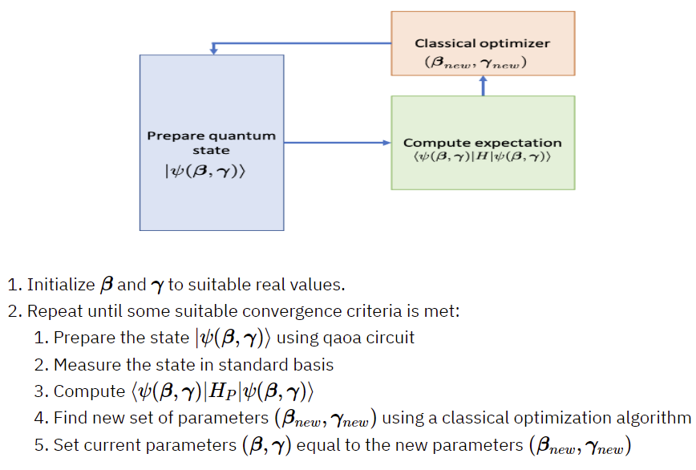

# Module 3 - Hybrid Quantum-Classical Compilation

## Overview
The goal of Module 3 is to demonstrate how to separate the quantum logic from classical logic and then producing unified intermediate representation (IR) from hybrid quantum-classical compilation.

### Maxcut Hybrid Algorithm
First we begin by examining how the hybrid Quantum Approximate Optimization (QAOA) algorithm solves the Maxcut optimization problem. The steps to solve the Maxcut optimization problem is shown below:
 
Note: This diagram is pulled directly from Qiskits website, **[HERE](https://qiskit.org/textbook/ch-applications/qaoa.html)**

This algorithm is hybrid because the classical optimizer executes on a cpu to obtain new parameters $\beta$ and $\gamma$, whereas the quantum processing unit(qpu) updates the parametrized QAOA circuit with these new parameters and measures the state in the standard basis. This process repeats until the expectation value has been minimized, which give you the optimal parameters $\beta$ and $\gamma$ to use in your parametrized QAOA circuit.

## Python
The Python tutorials demonstrate how the quantum logic and classical logic of a QAOA circuit changes after each iteration. As you will see, the quantum logic (i.e. the parameters  $\beta$ and $\gamma$) does change at each iteration. This is useful to determine which elements of compilation and transpilation can be performed once and which must be re-performed each iteration.

### What else do we need?
Up to now, we have only distinguished **WHERE** the quantum logic and classical logic occur. We still need to **SEPARATE** the quantum logic from the classical logic. For example, the Intel quantum compiler toolchain’s hybrid compilation workflow is a perfect example of separating the quantum logic from the classical logic which then creates a unified hybrid executable binary file. For more information please visit, **[HERE](https://arxiv.org/abs/2202.11142).** We have a similar objective, but want to use open source tools that everyone has access to!

## Q#

## C++
