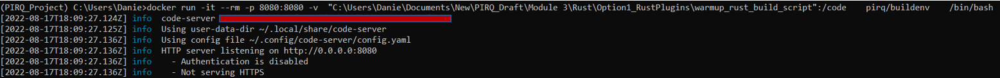
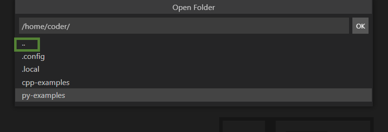
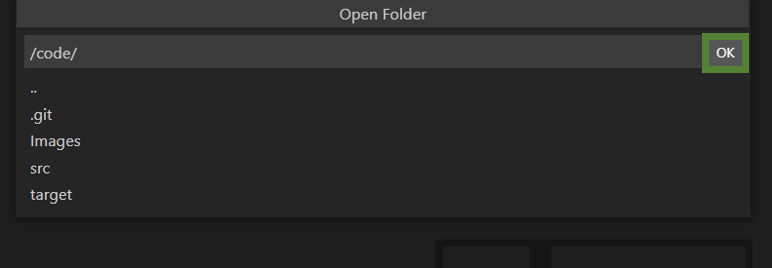

# Calling QCOR from Rust Build Script

## Prerequisites
1) Must have docker installed on your local machine. May download [HERE](https://docs.docker.com/engine/install/)

2) Must have a docker file containing both QCOR and Rust(i.e. so that the Rust build script can call QCOR). The Dockerfile included in the [Docker_build](../Docker_Build/) directory accomplishes this.  

## Quick Background
All this code is stored on your local machine. However, this code needs to be mounted into the docker container so that it can see it. This way, the docker container (which has QCOR and Rust and any other build tools) can compile your code (the code calls into the tools). Whenever the container is stopped, all the code changes are still stored on your local machine.

## Running 
1. Open a terminal on your local machine. Does not matter which directory you are in. Run the following command to open a web based Visual Studio Code on your web browser:

    `docker run -it --rm -p 8080:8080 -v  LOCAL_PATH_HERE:/code    pirq/buildenv    /bin/bash`

    Replace LOCAL_PATH_HERE with the absoulte path to where the `warmup_rust_build_script` folder is on your local machine. For example, it may look like:

    `docker run -it --rm -p 8080:8080 -v  "C:\Users\Danie\Documents\New\PIRQ_Draft\Module 3\Rust\Option1_RustPlugins\warmup_rust_build_script":/code    pirq/buildenv    /bin/bash`

    Notice the `""` around my absolute path. This is necessary because there is a space, at `Module 3`

    Your terminal on your local machine should be doing some http tasks like this.

    

2. Copy this link and paste it into a web based browser of your choice:

   `http://localhost:8080/`

    You should see a visual studio code interface.

3.  When you try to open up a folder you should see this. Click on the green box twice to get to the `\code` folder 

    

    Open up the folder `/code` by clicking OK.
    

    You should now be able to see the files in `warmup_rust_build_script`

4. Open a terminal in the web based visual studio code interface. Compile then run program with, `cargo run`

5. At this point, your Rust build script has called the QCOR MLIR tool command to convert [OpenQASM3](src/QCOR_Compatible_B-V_transpiled_Superconducting_qc3.qasm)
 code into [LLVM](src/B-V_transpiled_Superconducting_qc3.ll). Congrats!

    **Note:** QCOR directs output LLVM to the stderr stream, not the stdout stream.

## Acknowledgements
Nicholas Cioli of Zapata Computing