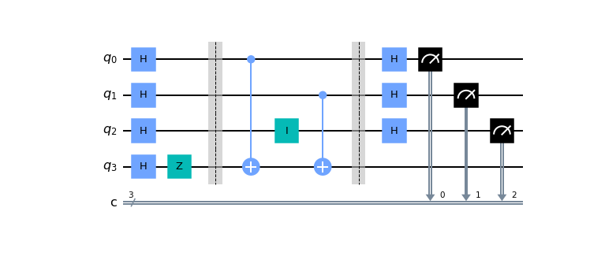
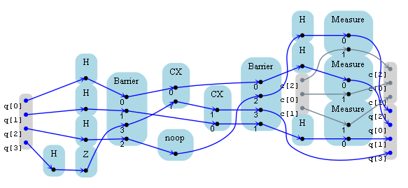
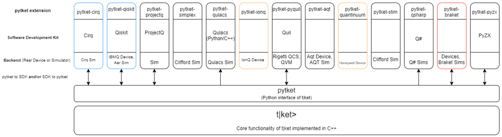

## t|ket> 

`t|ket>` is a set of quantum programming tools written in C++ by Cambridge Quantum Computing. Click [HERE](https://github.com/CQCL/tket) for more information.

## pytket
`pytket` is a python module to interface with `t|ket>`.

For more information please click the following links:
1. [pytket GuideBook](https://cqcl.github.io/tket/pytket/api/index.html) **(Installation instructions provided here)**
2. [pytket Examples](https://github.com/CQCL/pytket/tree/main/examples)

## Circuit Creation to Backend Execution
As you have likely noticed, tket involves many different software tools and quantum backends. Its usefulness comes from being able to create a quantum circuit in one software development kit (SDK), and then execute it on a backend from a different provider. For example, you may have the following sequence:

1. Qiskit Circuit

2. Qiskit Circuit **to** Pytket Circuit.

 

3. Execute circuit on Q# Simulator. **PICTURE HERE.**

This is one of **MANY** sequences you can do. To understand the other possible sequences from **circuit creation to backend execution**, we must understand the software tools and quantum backends suppoerted by `pytket`. Here is a simple high level diagram showing you the interoperability of all these software tools and backends. 

For example, lets take a look at the top leftmost box. 
1. **pytket-cirq** is the pytket extension
2. **Cirq** is the SDK.
3. **Cirq Sim** is the Cirq simulated backend. 

The bi-directional arrow indicates we can:
1. Convert a **Cirq circuit** into a **pytket circuit**.
2. Convert a **pytket circuit** into a **Cirq circuit**. 

The box outline is in **blue**, meaning the backend is implemented using **superconducting** qubits.
(**Orange** outline indicates the backend is an **ion-trap** device.)
(**Red** outline indicates the backend is **more than one implementation.**)

We could, the following sequence: 
1. Create Cirq circuit --> Convert to pytket circuit --> Run on **ANY** backend(i.e. IBMQ Device, IonQ Device, AQT Device, etc.)

The key here is, once you have a pytket circuit, you can execute the pytket circuit on any backend of your choosing. There are many possibilities from **circuit creation to backend execution!** Click [HERE](https://github.com/CQCL/pytket/blob/main/examples/backends_example.ipynb) to see an example of a pytket circuit ran on multiple backends.

## More Resources
Click [HERE](https://cqcl.github.io/pytket-extensions/api/index.html#http://) to see all the pytket extensions.
1. [Cirq](https://quantumai.google/cirq)
2. [Qiskit](https://qiskit.org/)
3. [ProjectQ](https://projectq.ch/)
4. [PySimplex](https://github.com/Pakniat/PySimplex)
5. [Qulacs](https://github.com/qulacs/qulacs)
6. [IonQ](https://docs.ionq.com/#section/Introduction)
7. [PyQuil](https://pyquil-docs.rigetti.com/en/stable/)
8. [AQT](https://www.aqt.eu/)
9. [Quantinuum](https://github.com/CQCL) Honeywell provides hardware while Cambridge Quantum Computing provides Quantum software. More information [HERE](https://www.honeywell.com/us/en/news/2021/11/things-to-know-about-quantinuum).
10. [Stim](https://github.com/quantumlib/Stim)
11. [Q#](https://docs.microsoft.com/en-us/azure/quantum/overview-what-is-qsharp-and-qdk)
12. [Amazon Braket](https://docs.aws.amazon.com/braket/latest/developerguide/braket-devices.html)
13. [PyZX](http://zxcalculus.com/intro.html) ([Second Link](https://pyzx.readthedocs.io/en/latest/
))

## Reference Links

<https://cqcl.github.io/tket/pytket/api/>
